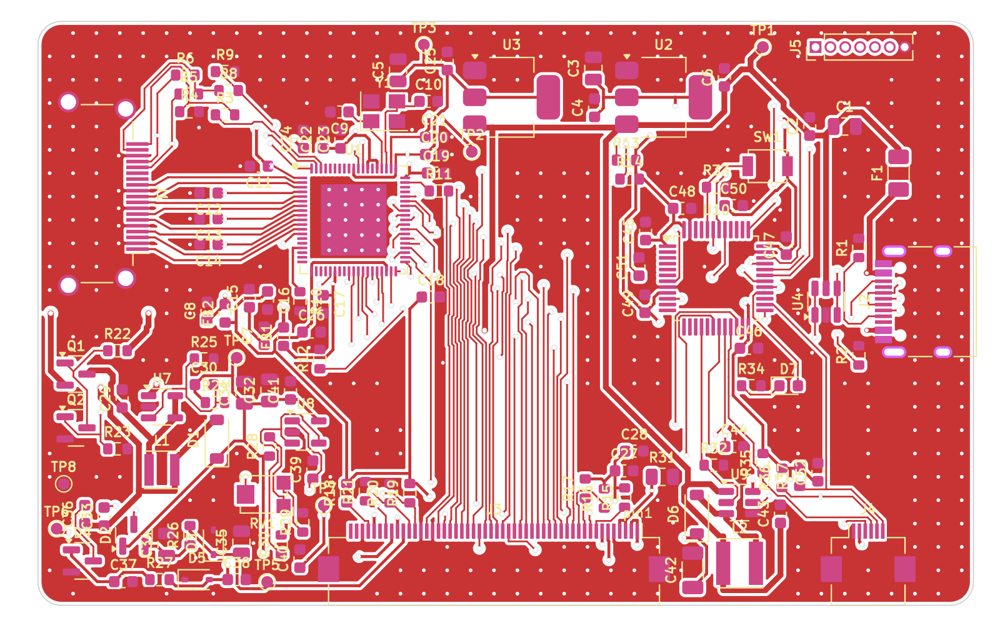

# برد راه‌انداز LCD هفت اینچ AT070TN92 با ورودی HDMI و تاچ USB

برد دولایه‌ی کوچک (۸۰×۵۰ میلی‌متر) که پشت LCD چسبانده می‌شود:

* **ورودی HDMI** (از رزبری‌پای) ← **LT8619C** ← RGB موازی ۲۴ بیتی (حالت DE) ← کانکتور FPC پنجاه‌پین **AT070TN92**
* **تاچ خازنی GT915** (روی FPC تاچ‌پنل، رابط I2C) ← **STM32F072** ← **USB HID Multi-Touch** (۵ نقطه) به رزبری‌پای
* **تغذیه‌ی کل برد از همان کابل USB-C** (۵ ولت از پورت USB رزبری‌پای)
* تولید ولتاژهای پنل روی برد: AVDD=10.4V، VGH=+16V، VGL=−6.8V، VCOM قابل تنظیم، درایور بک‌لایت جریان‌ثابت ۱۸۰ mA با PWM

> ⚠️ این طراحی کامل است و همه‌ی بررسی‌های نرم‌افزاری (DRC، تطبیق شماتیک با PCB، کامپایل فرم‌ور، اعتبارسنجی EDID) را پاس کرده، اما **هنوز ساخته و روی سخت‌افزار تست نشده است**. قبل از سفارش انبوه، یک نمونه بسازید و بخش «موارد قابل بررسی» را بخوانید.



> **نسخه‌ی DSI:** یک برد جداگانه (۶۸×۴۲ mm) هم هست که همین پنل و تاچ را مستقیم از پورت DSI رزبری‌پای و با پل ICN6211 راه می‌اندازد، بدون HDMI و بدون میکروکنترلر. طراحی در [`hardware_dsi/`](hardware_dsi/README.md) و Overlay و درایور لینوکس در `rpi_dsi/` است.

---

## ۱) بلوک دیاگرام

```
 HDMI-A ──TMDS──► LT8619C ──RGB888 + DE + PCLK──► J3 (FPC 50P) ──► AT070TN92
   │ DDC/HPD        ▲ I2C1 (0x32)                       ▲ AVDD/VGH/VGL/VCOM, VLED
   └─(EDID روی تراشه)│                                    │
                    STM32F072 ──── BIAS_EN ──► TPS61040 + پمپ‌های بار + LM321 (VCOM)
 USB-C ◄──USB FS──► │ ──── BL_PWM ───► TPS61165 (بک‌لایت ۱۸۰mA)
   │5V              │ ──── I2C2 ────► J4 (FPC 6P) ──► تاچ‌پنل GT915
   └► PTC ► AMS1117-3.3 / AMS1117-1.8 (+ فیلتر فریت برای تغذیه‌های آنالوگ LT8619C)
```

| بخش | قطعه | توضیح |
|---|---|---|
| گیرنده HDMI | LT8619C (QFN76) | کریستال 25MHz، EDID داخلی 800×480@60 که میکرو بارگذاری می‌کند؛ VTERM/VCCA33 و 1.8V آنالوگ با فریت جدا شده‌اند |
| میکرو | STM32F072CBT6 | USB بدون کریستال (HSI48 + CRS)، بوت‌لودر DFU داخلی |
| بایاس پنل | TPS61040 + 2×BAT54S + زنر | AVDD 10.4V، VGH 16V (دوبرابرکننده)، VGL −6.8V (معکوس‌کننده) |
| VCOM | LM321 + تریمر 10k (RV1) | محدوده 2.55 تا 4.5 ولت، برای کمترین فلیکر تنظیم شود |
| بک‌لایت | TPS61165 | 0.2V / 1.1Ω = 182mA، PWM با فرکانس 20kHz |
| تغذیه | AMS1117-3.3 و AMS1117-1.8 | هر دو از 5V؛ 1.8V با فریت به تغذیه‌های آنالوگ |

---

## ۲) ساختار ریپازیتوری

```
hardware/                 پروژه‌ی KiCad (نسخه 7)
  lcd_board.kicad_pro/.kicad_sch/.kicad_pcb    پروژه، شماتیک سلسله‌مراتبی (۴ صفحه)، PCB
  lcd_board.pretty/       فوت‌پرینت‌های اختصاصی (QFN76 لونتیوم، FPC پنجاه‌پین)
  lcd_board.kicad_sym     سمبل LT8619C
  fab/                    فایل‌های ساخت: gerber.zip، BOM و CPL برای JLCPCB
  gen/                    اسکریپت‌هایی که کل طراحی را می‌سازند (منبع اصلی = design.py)
firmware/                 فرم‌ور STM32F072 (C + TinyUSB)
hardware_dsi/             نسخه‌ی DSI (ICN6211) — پروژه‌ی KiCad جدا با README خودش
rpi_dsi/                  Device Tree Overlay و اسکریپت ساخت درایور ICN6211 برای نسخه‌ی DSI
docs/                     schematic.pdf، schematic_dsi.pdf و تصاویر برد
*.pdf                     دیتاشیت‌ها
```

**منبع اصلی طراحی فایل `hardware/gen/design.py` است** (لیست قطعات و همه‌ی اتصالات). شماتیک، PCB و BOM از روی آن ساخته می‌شوند و `verify_netlist.py` تطابق شماتیک و طراحی را بررسی می‌کند. البته می‌توانید فایل‌های KiCad را مستقیم هم ویرایش کنید.

---

## ۳) مشخصات PCB

| مورد | مقدار |
|---|---|
| ابعاد | 80 × 50 mm، گوشه‌های گرد R2 |
| لایه | ۲ لایه، FR4، ضخامت پیشنهادی 1.0 یا 1.6 mm، مس 1oz |
| حداقل ترک/فاصله | 0.15 / 0.15 mm (تغذیه 0.25 و 0.5 mm) |
| ویا | سوراخ 0.3 / قطر 0.6 mm (ظرفیت استاندارد JLCPCB) |
| قطعات | **فقط روی رو (Top)**؛ پشت برد صاف است برای چسب دوطرفه |
| زمین | GND به‌صورت نت کامل مسیریابی شده + پور GND روی هر دو لایه + ~۳۰۰ ویای دوخت |
| DRC | **۰ خطای الکتریکی/فاصله و ۰ اتصال باز**؛ برچسب‌های سیلک بدون تداخل (هشدار فقط برای خطوط سیلک کانکتورهای لبه‌ی برد که سازنده برش می‌دهد) |
| سیلک‌اسکرین | برچسب‌ها با ارتفاع 0.8mm خودکار کنار هر قطعه گذاشته شده‌اند، روی پد/بدنه‌ی قطعه یا برچسب دیگر نمی‌افتند. ۱۳ برچسب در نواحی خیلی شلوغ جا نشدند و فقط در نقشه‌ی مونتاژ (`docs/img/pcb_assembly.png`) آمده‌اند |

نکات چیدمان:
* زوج‌های TMDS (HDMI) دستی و کوتاه (~۱۲ mm) کشیده شده‌اند و زیرشان لایه‌ی پشت زمین یکپارچه است. سرعت هر کانال برای 800×480 فقط 333Mbps است.
* خازن‌های دکاپلینگ پایه‌های VTERM/VCCA33 بین زوج‌های TMDS قرار گرفته‌اند.
* ترتیب پایه‌های RGB در LT8619C نسبت به FPC پنل وارونه است؛ گذرگاه RGB با ویا روی دو لایه جابه‌جا شده (بدون نیاز به رجیستر نامستند جابه‌جایی بیت).

---

## ۴) نصب مکانیکی و جهت FPC (مهم)

* FPC پنل (۳۰ میلی‌متر) از لبه‌ی پایین LCD به پشت تا می‌شود و از **لبه‌ی پایین برد** وارد J3 می‌شود. کنتاکت‌های FPC در این حالت رو به بالا (دور از برد) هستند، پس J3 باید **کانکتور Top-contact** باشد — همان چیزی که دیتاشیت Innolux پیشنهاد کرده: `Hirose FH12A-50S-0.5SH`.
* شماره‌ی پدهای J3 دقیقاً برابر شماره‌ی پین‌های FPC پنل است؛ **پین ۱ سمت راست** است (برد از رو، FPC از پایین وارد شود). همین جهت برای حالت تا‌نخورده (برد زیر پنل) هم درست است.
* برد را با **چسب دوطرفه‌ی فومی عایق** (۱ میلی‌متر) پشت پنل بچسبانید؛ پشت پنل فلزی است و ویاها با سولدرماسک پوشیده‌اند ولی عایق اضافه لازم است.
* J4 (FPC شش‌پین 0.5mm تاچ) هم روی لبه‌ی پایین است. ترتیب پین‌ها طبق مدار مرجع Goodix: `1 GND, 2 VDD(3.3V), 3 INT, 4 SCL, 5 SDA, 6 RST`. **ترتیب پین FPC تاچ‌پنل خودتان را حتماً چک کنید**؛ اگر فرق دارد، به یک تبدیل FPC یا تغییر ترتیب پین‌های J4 در `design.py` نیاز است.
* HDMI از لبه‌ی چپ و USB-C از لبه‌ی راست خارج می‌شوند.

---

## ۵) تغذیه و مصرف

| مصرف‌کننده | تقریبی |
|---|---|
| بک‌لایت (9.3V × 180mA ÷ راندمان) | ~2.0 W |
| LT8619C (1.8V و 3.3V، از LDO) | ~1.1 W از 5V |
| بایاس پنل + منطق + میکرو + تاچ | ~0.4 W |
| **جمع** | **~3.5 W ≈ 0.7 A از 5V** |

پورت‌های USB رزبری‌پای ۴ و ۵ این جریان را می‌دهند (مجموعاً 1.2A/1.6A). با کم کردن نور بک‌لایت مصرف کم می‌شود. فیوز PTC (1.1A) روی VBUS است.

ترتیب روشن شدن (طبق بخش 3.2 دیتاشیت پنل، توسط فرم‌ور):
`DVDD(3.3V) → آزاد شدن RESET → BIAS_EN (VGL و AVDD، سپس VGH با تأخیر RC) → داده‌ی تصویر → بعد از 200ms بک‌لایت`.
بک‌لایت فقط وقتی تصویر معتبر از HDMI دریافت می‌شود روشن است.

---

## ۶) ساخت برد (JLCPCB)

1. `hardware/fab/lcd_board_gerbers.zip` را برای ساخت PCB آپلود کنید (2 لایه).
2. برای مونتاژ: `hardware/fab/bom_jlcpcb.csv` و `hardware/fab/cpl_jlcpcb.csv`.
   * شماره‌های LCSC فقط برای قطعاتی که مطمئن بودم پر شده‌اند؛ بقیه را با MPN/مقدار جستجو کنید.
   * LT8619C معمولاً در LCSC نیست؛ از فروشنده‌های لونتیوم (مثلاً بازار چین) تهیه و دستی لحیم کنید (QFN76 با پد زیرین: هیتر هوای گرم/استنسیل).
   * چرخش‌ها در CPL را در پیش‌نمایش JLC کنترل کنید.
3. قطعات نصب‌نشده (DNP): J5 (هدر SWD/UART)، نقاط تست TP1..TP8.
4. همه‌ی مقاومت‌ها و خازن‌های کوچک پکیج **0603** هستند (لحیم دستی راحت). فقط چند خازن که به ظرفیت/ولتاژ بالا نیاز دارند 0805/1206 مانده‌اند (22µF، 4.7µF/25V، 1µF/50V، 2.2µF/50V) و مقاومت حسگر جریان بک‌لایت 0805 است.

---

## ۷) فرم‌ور

```sh
cd firmware
./fetch_deps.sh        # TinyUSB 0.17 + هدرهای CMSIS
make                   # نیاز به arm-none-eabi-gcc ؛ خروجی build/lcd_touch.bin
make flash-dfu         # دکمه‌ی BOOT را نگه دارید و USB را وصل کنید (dfu-util لازم است)
```

کارهایی که فرم‌ور انجام می‌دهد:
* ترتیب روشن شدن پنل و کنترل بک‌لایت
* راه‌اندازی LT8619C: ریست، خواندن Chip ID (0x16 0x04)، بارگذاری EDID (800×480@60Hz، 33.26MHz)، HPD، پیکربندی گیرنده و خروجی RGB888 SDR، تبدیل رنگ YCbCr→RGB، کپی تایمینگ ورودی به خروجی
* انتخاب آدرس GT915 (0x5D) با ترتیب INT/RESET دیتاشیت، خواندن رزولوشن تنظیم‌شده‌ی تاچ و مقیاس‌کردن به 800×480
* دستگاه USB HID «Touch Screen» پنج‌نقطه‌ای؛ لینوکس (hid-multitouch) بدون درایور اضافه می‌شناسد
* کنسول UART (پین‌های 5 و 6 هدر J5، 115200): دستورات `status`، `bl 0..100`، `phase 0..9`، `rot 0|1`، `swap`، `invx`، `invy`، `save`
* تنظیمات (نور، چرخش ۱۸۰ درجه، جهت تاچ، فاز PCLK) در فلش ذخیره می‌شوند

---

## ۸) تنظیم رزبری‌پای

با Raspberry Pi OS (KMS) معمولاً هیچ تنظیمی لازم نیست: EDID برد حالت 800×480 را اعلام می‌کند و تاچ به‌صورت خودکار شناخته می‌شود. اگر تصویر نیامد، در `/boot/firmware/cmdline.txt` اضافه کنید:

```
video=HDMI-A-1:800x480M@60
```

و برای Pi های قدیمی (درایور غیر KMS) در `config.txt`:

```
hdmi_group=2
hdmi_mode=87
hdmi_cvt=800 480 60 6 0 0 0
hdmi_drive=1
```

برای چرخاندن ۱۸۰ درجه بهتر است از دستور `rot 1` کنسول برد استفاده کنید (پنل و تاچ هر دو در سخت‌افزار برمی‌گردند).

---

## ۹) موارد قابل بررسی و ریسک‌ها (لطفاً بخوانید)

1. **LT8619C سند رسمی رجیستر ندارد.** توالی رجیسترها از درایورهای متن‌باز (Hardkernel u-boot و درایور V4L2 راک‌چیپ) گرفته شده و برای خروجی RGB888 کار کرده است. اگر رنگ‌ها لرزش/نویز داشتند فاز PCLK را با `phase 0..9` تغییر دهید. برای تولید، از Lontium (support@lontium.com) شماتیک مرجع و Programming Guide بخواهید.
2. در گزارش موجود در ریپازیتوری گفته شده که خطوط TMDS با خازن 100nF کوپل AC شوند؛ **این برای HDMI درست نیست** — TMDS کوپل DC است و ترمینیشن به 3.3V از پایه‌های VTERM می‌آید. در این برد اتصال مستقیم است.
3. جهت FPC پنل و نوع کانکتور Top-contact (بخش ۴) را قبل از لحیم کنترل کنید.
4. ترتیب پین FPC تاچ‌پنل شما ممکن است با ترتیب مرجع Goodix فرق داشته باشد.
5. GT915 برای پنل‌های ۴.۵ تا ۶ اینچ طراحی شده؛ پیکربندی (Config) آن را سازنده‌ی تاچ‌پنل در فلش آی‌سی ذخیره کرده است. اگر محورها برعکس بود با `swap/invx/invy` اصلاح کنید.
6. VCOM هر پنل باید با RV1 برای کمترین فلیکر تنظیم شود (نقطه‌ی تست TP7). مقدار معمول طبق دیتاشیت ~3.6V.
7. محافظ ESD روی خطوط TMDS عمداً حذف شده تا مسیرها کوتاه و تمیز بمانند (سیگنال‌ها مستقیم به LT8619C می‌روند).
8. پین‌اوت آی‌سی‌ها از کتابخانه‌ی رسمی KiCad برداشته شده و پین‌اوت TPS61040 و TPS61165 با دیتاشیت TI چک شد؛ فوت‌پرینت QFN76 از ابعاد صفحه 16 دیتاشیت LT8619C ساخته شده (پد زیرین 5.81×6.31mm).
9. VID/PID USB از `pid.codes` (آزمایشی 1209:0001) است؛ برای محصول تجاری عوض کنید.

---

## ۱۰) ساخت دوباره‌ی طراحی از اسکریپت‌ها

نیازمندی‌ها: KiCad 7 (`kicad-cli` و ماژول پایتون `pcbnew`)، Java و Xvfb برای Freerouting.

```sh
cd hardware/gen
python3 make_libs.py                 # فوت‌پرینت/سمبل اختصاصی
python3 gen_sch.py                   # شماتیک
python3 verify_netlist.py            # تطبیق شماتیک با design.py
python3.12 pcb.py                    # چیدمان + مسیرهای دستی (TMDS، USB، VCOM، I2C و تغذیه آنالوگ LT8619C)
python3.12 route.py export           # فایل DSN برای Freerouting
java -jar freerouting-2.0.1.jar --gui.enabled=false -de ../lcd_board.dsn -do ../lcd_board.ses -mp 100
python3.12 route.py import ../lcd_board.ses   # مسیرها + پورها + ویاهای دوخت
python3.12 check.py --fill           # پر کردن پورها و DRC
python3 fab.py                       # گربر، BOM، CPL، تصاویر و PDF شماتیک
```

فایل `hardware/lcd_board.ses` (خروجی Freerouting که برد فعلی از آن ساخته شده) در ریپازیتوری هست، پس بدون اجرای دوباره‌ی Freerouting هم `route.py import` همین برد را می‌سازد.

## مجوز

سخت‌افزار: CERN-OHL-P v2. فرم‌ور: GPL-2.0-or-later (چون توالی LT8619C از کد GPL گرفته شده).
