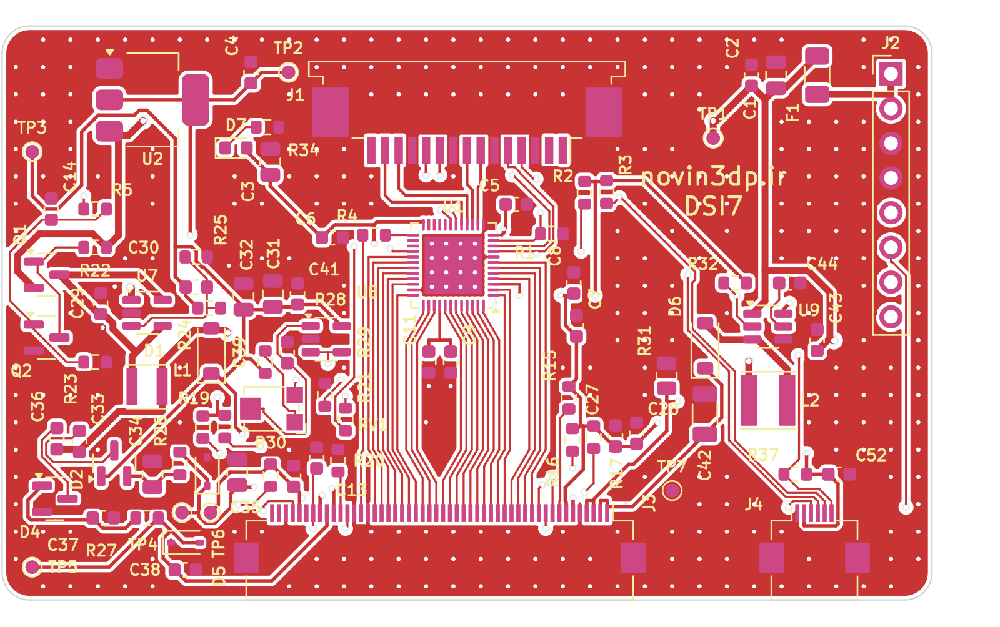

# نسخه‌ی DSI: راه‌اندازی AT070TN92 مستقیم از پورت DSI رزبری‌پای

این برد دولایه (۶۸×۴۲ میلی‌متر) همان پنل ۷ اینچ AT070TN92 و تاچ GT915 را این بار از **پورت DSI رزبری‌پای** راه می‌اندازد. نسخه‌ی HDMI در پوشه‌ی `hardware/` دست‌نخورده باقی مانده است.

* **DSI رزبری‌پای** (۲ لِین) ← **ICN6211** (مبدل MIPI-DSI به RGB888) ← کانکتور FPC پنجاه‌پین پنل
* **تاچ GT915** مستقیم روی **I2C کانکتور DSI**؛ درایور `goodix` لینوکس آن را می‌خواند. میکروکنترلر و USB حذف شده‌اند.
* **۵ ولت و ۴ سیگنال کنترلی** با یک کابل ۸ رشته از هدر ۴۰ پین رزبری‌پای می‌آیند (کابل DSI تغذیه‌ی ۵ ولت ندارد).
* بخش تغذیه‌ی پنل (AVDD، VGH، VGL، VCOM) و درایور بک‌لایت همان مدارهای نسخه‌ی HDMI هستند.

> ⚠️ این طراحی همه‌ی بررسی‌های نرم‌افزاری را پاس کرده: DRC، تطبیق شماتیک با PCB و کامپایل Overlay. ولی **هنوز ساخته و روی سخت‌افزار تست نشده است**. بخش «ریسک‌ها» را حتماً بخوانید.



---

## ۱) بلوک دیاگرام

```
 Pi DSI (15P 1mm) ──D0,D1,CLK──► ICN6211 ──RGB888 + DE + PCLK──► J3 (FPC 50P) ──► AT070TN92
        │ SDA/SCL (i2c_csi_dsi)                                     ▲ AVDD/VGH/VGL/VCOM, VLED
        └──────────────────────────► J4 (FPC 6P) ──► تاچ GT915      │
 Pi 40-pin ──J2──► 5V ─► PTC ─► AMS1117-3.3 ─► 3.3V (ICN6211، منطق پنل، تاچ)
                  DSI_EN (GPIO22) ─► EN آی‌سی، RESET پنل (۱ms)، BIAS_EN (RC حدود ۵۰ms) ─► TPS61040 + پمپ‌های بار + LM321
                  TP_INT (GPIO27)، TP_RST (GPIO17) ─► تاچ
                  BL_PWM (GPIO18) ─► TPS61165 (بک‌لایت ۱۸۰mA؛ پیش‌فرض روشن)
```

| بخش | قطعه | توضیح |
|---|---|---|
| مبدل DSI | ICN6211 (QFN48 6×6، LCSC C246085) | هر سه تغذیه 3.3V، کلاک مرجع از کلاک DSI (پایه REF_CLK به زمین)، VCORE با 1µF + 10nF |
| بایاس پنل | TPS61040 + 2×BAT54S + زنر | AVDD 10.4V، VGH 16V، VGL −6.8V |
| VCOM | LM321 + تریمر RV1 | 2.55 تا 4.5 ولت |
| بک‌لایت | TPS61165 | 182mA، روشن/خاموش یا PWM از GPIO18 |
| تغذیه | AMS1117-3.3 | از 5V هدر |

**ترتیب روشن شدن کاملاً سخت‌افزاری است.** وقتی لینوکس پایه‌ی EN پل را بالا می‌برد، RESET پنل بعد از حدود ۱ms آزاد می‌شود. بعد از حدود ۵۰ms هم تغذیه‌های AVDD، VGL و VGH روشن می‌شوند. با خاموش شدن نمایشگر (EN پایین) همه‌ی این‌ها با هم خاموش می‌شوند.

---

## ۲) اتصال به رزبری‌پای

### کابل DSI (J1)

* J1 یک کانکتور FPC پانزده‌پین با گام 1mm است، با همان پین‌اوت کانکتور DSI در Pi 3 و Pi 4.
* **Pi 5 و CM4/CM5** کانکتور ۲۲ پین 0.5mm دارند. برای آن‌ها از کابل استاندارد «Raspberry Pi Display Cable 22-pin to 15-pin» استفاده کنید.
* **جهت کابل:** برای J1 یک کانکتور **Dual-contact** (کنتاکت در بالا و پایین) بگذارید. اگر تصویر نیامد، کابل را در سمت برد **برعکس** (رو به پایین) جا بزنید؛ این کار ترتیب پین‌ها را آینه می‌کند.
* پایه‌های ۱، ۱۴ و ۱۵ کانکتور روی برد عمداً **وصل نیستند**: پین ۱ زمین است و ۱۴ و ۱۵ تغذیه‌ی 3.3V رزبری‌پای. برای همین اگر کابل برعکس جا خورد، 3.3V رزبری‌پای به زمین اتصال کوتاه نمی‌شود. زمین از پایه‌های ۴، ۷، ۱۰ و ۱۳ وصل است.

### کابل هدر (J2، هدر ۸ پین 2.54mm)

| J2 | سیگنال | پین هدر رزبری‌پای |
|---|---|---|
| 1 | +5V | 2 |
| 2 | +5V | 4 |
| 3 | GND | 6 |
| 4 | GND | 9 |
| 5 | DSI_EN (EN آی‌سی ICN6211) | 15 (GPIO22) |
| 6 | TP_INT | 13 (GPIO27) |
| 7 | TP_RST | 11 (GPIO17) |
| 8 | BL_PWM (بک‌لایت) | 12 (GPIO18) |

اگر GPIO دیگری لازم دارید، پارامترهای Overlay را عوض کنید (بخش ۳). بدون سیم BL_PWM بک‌لایت همیشه روشن است (مقاومت pull-up 10k).

### تاچ (J4)

ترتیب پین‌ها مثل نسخه‌ی HDMI است: `1 GND, 2 3.3V, 3 INT, 4 SCL, 5 SDA, 6 RST`. خطوط SCL و SDA به I2C کانکتور DSI وصل‌اند. **ترتیب پین FPC تاچ‌پنل خودتان را چک کنید.**

### مصرف

بک‌لایت حدود 2W، پنل و ICN6211 حدود 0.4W: در مجموع **حدود 0.5A از 5V هدر**. منبع تغذیه‌ی رزبری‌پای باید این جریان اضافه را بدهد (منبع رسمی 3A/5A کافی است).

---

## ۳) نرم‌افزار رزبری‌پای

درایور لینوکس ICN6211 (`chipone-icn6211`) در کرنل اصلی لینوکس هست، **ولی در کرنل Raspberry Pi OS فعال نشده**. اسکریپت `rpi_dsi/icn6211/install.sh` سورس همان نسخه‌ی کرنل را از گیت‌هاب Raspberry Pi دانلود می‌کند. بعد ماژول را می‌سازد و نصب می‌کند، Overlay را کامپایل می‌کند و خط لازم را به `config.txt` اضافه می‌کند:

```sh
sudo apt install linux-headers-rpi-v8 device-tree-compiler   # Pi 5: linux-headers-rpi-2712
cd rpi_dsi/icn6211
sudo ./install.sh
sudo reboot
```

بعد از هر به‌روزرسانی کرنل، `install.sh` را دوباره اجرا کنید.

فایل `rpi_dsi/at070tn92-dsi-overlay.dts` این‌ها را تعریف می‌کند:
* پل `chipone,icn6211` روی DSI1 با ۲ لِین و EN روی GPIO22
* پنل `panel-dpi` با تایمینگ دیتاشیت AT070TN92: 33.3MHz، HFP 210، HBP+HS 46، VFP 22، VBP+VS 23. حالت DE فعال است و داده در لبه‌ی بالارونده‌ی کلاک فرستاده می‌شود، چون پنل در لبه‌ی پایین‌رونده نمونه می‌گیرد.
* بک‌لایت `gpio-backlight` روی GPIO18
* تاچ `goodix` با آدرس 0x5D روی `i2c_csi_dsi`، INT روی GPIO27 و RST روی GPIO17

پارامترهای Overlay (در `config.txt`، مثلاً `dtoverlay=at070tn92-dsi,touch_invx,touch_invy`):

| پارامتر | کار |
|---|---|
| `dsi0` | استفاده از پورت DSI0 (روی Pi 5: DISP0؛ روی CM: DSI0) |
| `enable_gpio=N` / `backlight_gpio=N` / `touch_int=N` / `touch_reset=N` | تغییر GPIOها |
| `touch_invx` / `touch_invy` / `touch_swapxy` | اصلاح جهت تاچ |
| `touch_addr=0x14` / `disable_touch` | آدرس دیگر تاچ / غیرفعال کردن تاچ |
| `clock-frequency=N` | فرکانس پیکسل (پیش‌فرض 33300000) |

چرخش ۱۸۰ درجه: در دسکتاپ از Screen Configuration، یا با سخت‌افزار: R19/R20 (پایه‌های L/R و U/D پنل) را برعکس ببندید و تاچ را با `touch_invx,touch_invy` برگردانید.

---

## ۴) مشخصات PCB

| مورد | مقدار |
|---|---|
| ابعاد | 68 × 42 mm، گوشه‌های گرد R2 (نسخه‌ی HDMI: 80×50) |
| لایه | ۲ لایه، FR4، مس 1oz |
| حداقل ترک/فاصله | 0.15 / 0.15 mm؛ ویا 0.3/0.6 mm (ظرفیت استاندارد JLCPCB) |
| قطعات | ۸۵ قطعه، **فقط روی رو (Top)** |
| زوج‌های DSI | دستی کشیده شده‌اند (حدود ۸ میلی‌متر، ترک 0.2mm). ترتیب لِین‌ها در کانکتور رزبری‌پای و ICN6211 یکی نیست، برای همین زوج کلاک برای عبور از زیر لِین ۱ از لایه‌ی پشت می‌رود (۴ ویا). |
| گذرگاه RGB | ۲۶ خط RGB/DE/DCLK دستی و منظم کشیده شده‌اند: هر خط ستون خودش را دارد و با زاویه‌ی ۳۰ درجه به پد FPC می‌رسد. فقط DE از زیر گذرگاه روی لایه‌ی پشت رد می‌شود. بقیه‌ی نت‌ها با Freerouting کشیده شده‌اند. |
| DRC | **۰ خطا و ۰ اتصال باز**؛ ۸۲ برچسب سیلک بدون تداخل، ۳ برچسب (C40، D3، R18) فقط در نقشه‌ی مونتاژ `docs/img/dsi_pcb_assembly.png` آمده‌اند |

---

## ۵) ساخت (JLCPCB)

1. `hardware_dsi/fab/lcd_dsi_gerbers.zip` برای ساخت PCB.
2. `hardware_dsi/fab/bom_jlcpcb.csv` و `cpl_jlcpcb.csv` برای مونتاژ. شماره‌ی LCSC آی‌سی ICN6211: C246085 (موجودی را هنگام سفارش چک کنید).
3. نقاط تست TP1..TP7 نصب نمی‌شوند. J2 (هدر) را خودتان لحیم کنید.

---

## ۶) ریسک‌ها و نکات (لطفاً بخوانید)

1. **ترتیب رنگ‌ها:** درایور لینوکس رجیستر جابه‌جایی RGB را تنظیم نمی‌کند. طبق راهنمای Chipone فرض شده که حالت پیش‌فرض `DATA[7:0]=R`، `DATA[15:8]=G` و `DATA[23:16]=B` است. اگر قرمز و آبی جابه‌جا بودند، ایراد از این فرض است. می‌توان آن را با یک خط در درایور (رجیستر SYS_CTRL) اصلاح کرد.
2. **جهت کابل DSI** (بخش ۲): کانکتور Dual-contact بگذارید و اگر تصویر نیامد کابل را در سمت برد برعکس کنید.
3. امپدانس زوج‌های DSI روی برد ۲ لایه دقیقاً 100Ω نیست. ولی مسیرها کوتاه‌اند (حدود ۸mm) و سرعت هر لِین برای 800×480 فقط حدود 400Mbps است. ضخامت 1.0mm برای برد بهتر است.
4. پل I2C کانکتور DSI به pull-up نیاز دارد؛ R2/R3 (4.7k به 3.3V برد) روی برد هستند. برد را قبل یا هم‌زمان با رزبری‌پای روشن کنید (هر دو از یک 5V تغذیه می‌شوند).
5. درایور goodix شناسه‌ی GT915 را از خود آی‌سی می‌خواند. Config تاچ‌پنل در فلش GT915 است. اگر محورها برعکس بود از پارامترهای `touch_*` استفاده کنید.
6. VCOM هر پنل را با RV1 برای کمترین فلیکر تنظیم کنید (نقطه‌ی تست TP6).
7. جهت FPC پنل و کانکتور Top-contact مثل نسخه‌ی HDMI است (بخش ۴ README اصلی).

---

## ۷) ساخت دوباره از اسکریپت‌ها

اسکریپت‌های عمومی (`sexpr`، `symlib`، `silk`) از `hardware/gen` استفاده می‌شوند؛ بقیه در `hardware_dsi/gen` هستند و منبع اصلی طراحی فایل `design.py` است.

```sh
cd hardware_dsi/gen
python3 make_libs.py && python3 gen_sch.py && python3 verify_netlist.py
python3.12 pcb.py                         # چیدمان + زوج‌های DSI + خروجی‌های کوتاه پایه‌های ICN6211
python3.12 route.py export
java -jar freerouting-2.0.1.jar --gui.enabled=false -de ../lcd_dsi.dsn -do ../lcd_dsi.ses -mp 100 --router.via_costs=30
python3.12 route.py import ../lcd_dsi.ses
python3.12 check.py --fill
python3 fab.py
```

فایل `lcd_dsi.ses` (مسیرهای برد فعلی) در ریپازیتوری هست.
