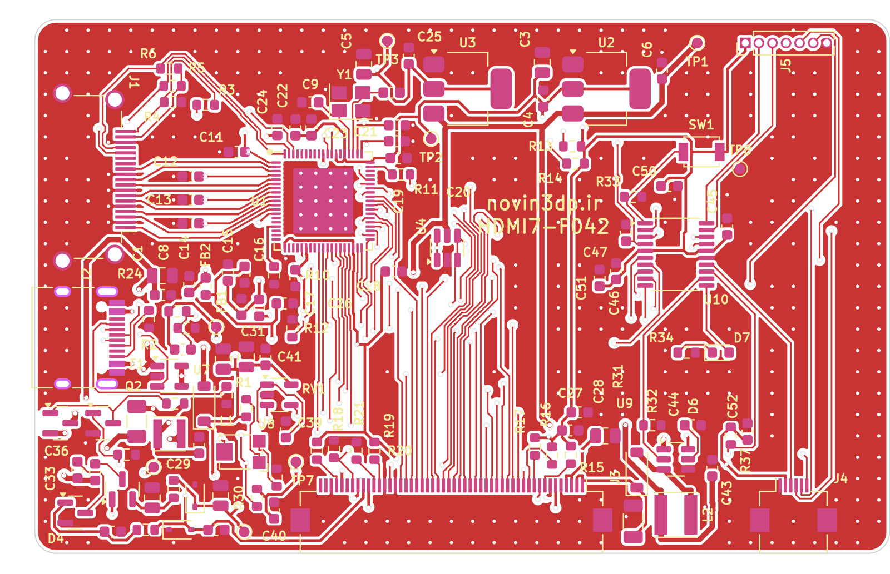

# HDMI7 با میکروکنترلر STM32F042F6P6

این پروژه‌ی جدا همان برد HDMI7 است (HDMI ← LT8619C ← AT070TN92، تاچ GT915 ← USB HID)، فقط میکروی **STM32F072CBT6 (LQFP-48)** با **STM32F042F6P6 (TSSOP-20)** عوض شده. ابعاد (80×50mm)، جای کانکتورها و همه‌ی بخش‌های دیگر مثل نسخه‌ی اصلی در `hardware/` است.

> ⚠️ همه‌ی بررسی‌های نرم‌افزاری پاس شده‌اند (DRC، تطبیق شماتیک با PCB، کامپایل فرم‌ور)، ولی برد **هنوز ساخته و تست نشده است**.



---

## ۱) چرا F042 جواب می‌دهد

| نیاز | STM32F042F6P6 |
|---|---|
| USB بدون کریستال | دارد (HSI48 + CRS، مثل F072). پایه‌های 17 و 18 با remap می‌شوند PA11/PA12 |
| بوت‌لودر DFU از USB | دارد (دکمه‌ی BOOT روی پایه‌ی ۱ = BOOT0) |
| حافظه | فرم‌ور 20.8KB از 32KB فلش و حدود 3.3KB از 6KB رم (با استک) |
| I2C | فقط **یک** I2C دارد. LT8619C (آدرس 0x32) و GT915 (آدرس 0x5D) روی یک باس با سرعت 400kHz هستند؛ هر دو این سرعت را پشتیبانی می‌کنند |
| PWM بک‌لایت | TIM3_CH1 روی PA6 (مثل قبل) |
| کنسول UART | USART2 روی PA2/PA3 (هدر J5، پایه‌های ۵ و ۶) |

## ۲) فرق با نسخه‌ی F072

**جای USB-C:** در این نسخه کانکتور USB-C در **لبه‌ی چپ، درست زیر سوکت HDMI** است. به این ترتیب هر دو کابل رزبری‌پای (HDMI و USB) از یک طرف برد خارج می‌شوند. آی‌سی محافظ ESD (U4) روی مسیر USB به سمت میکرو قرار گرفته، چون کنار کانکتور جا نبود. بخش سوئیچ تغذیه‌ی بایاس (Q1، Q2 و TPS61040) کمی جابه‌جا شده است.

TSSOP-20 فقط ۱۵ پایه‌ی I/O دارد، پس دو چیز حذف شد:

1. **جهت اسکن پنل (L/R و U/D) با مقاومت تعیین می‌شود، نه با میکرو.** پیش‌فرض: R19 (L/R) به 3.3V و R20 (U/D) به زمین (تصویر عادی). برای چرخش ۱۸۰ درجه، R19 را به زمین و R20 را به 3.3V ببندید و در کنسول `rot 1` را بزنید تا تاچ هم برگردد. راه دیگر چرخاندن تصویر در خود رزبری‌پای است.
2. **ورودی تشخیص 5V کابل HDMI (و مقاومت‌های R8/R9) حذف شد.** فرم‌ور وجود تصویر را مثل قبل از خود LT8619C می‌خواند؛ فقط خط «HDMI +5V» از دستور `status` کنسول حذف شده است.

پایه‌های میکرو:

| پایه | سیگنال | پایه | سیگنال |
|---|---|---|---|
| 1 | BOOT0 (دکمه SW1) | 11 | PA5: LED |
| 2 | PF0: I2C_SDA | 12 | PA6: BL_PWM |
| 3 | PF1: I2C_SCL | 13 | PA7: TP_RST |
| 4 | NRST | 14 | PB1: TP_INT |
| 5 | VDDA | 15 | VSS |
| 6 | PA0: LT_RSTN | 16 | VDD |
| 7 | PA1: BIAS_EN | 17 | PA11: USB D− |
| 8 | PA2: UART TX | 18 | PA12: USB D+ |
| 9 | PA3: UART RX | 19 | PA13: SWDIO |
| 10 | PA4: LCD_RST | 20 | PA14: SWCLK |

مقاومت‌های pull-up باس I2C مشترک: R13/R14 با مقدار 2.2k (R35/R36 حذف شدند).

## ۳) فرم‌ور

فرم‌ور همان کد `firmware/` است با یک هدف ساخت جدا:

```sh
cd firmware
./fetch_deps.sh
make BOARD=f042              # خروجی: build_f042/lcd_touch_f042.bin
make BOARD=f042 flash-dfu    # دکمه‌ی BOOT را نگه دارید و USB را وصل کنید
```

## ۴) مشخصات PCB و ساخت

| مورد | مقدار |
|---|---|
| ابعاد | 80 × 50 mm، ۲ لایه (مثل نسخه‌ی اصلی) |
| قطعات | ۱۲۰ (۶ قطعه کمتر از نسخه‌ی F072) |
| DRC | **۰ خطا و ۰ اتصال باز**. یک هشدار سیلک مربوط به علامت پایه‌ی ۱ فوت‌پرینت استاندارد TSSOP است و ۸ هشدار خطوط سیلک کانکتورها در لبه‌ی برد |
| سیلک | ۹۵ برچسب کنار قطعات است؛ ۲۵ برچسب در ناحیه‌ی شلوغ سمت چپ جا نشدند و فقط در نقشه‌ی مونتاژ `docs/img/f042_pcb_assembly.png` آمده‌اند |
| فایل‌ها | `fab/lcd_f042_gerbers.zip`، `fab/bom_jlcpcb.csv`، `fab/cpl_jlcpcb.csv`؛ شماتیک: `docs/schematic_f042.pdf` |

ساخت دوباره از اسکریپت‌ها مثل نسخه‌ی اصلی است (بخش ۱۰ README اصلی)، فقط در پوشه‌ی `hardware_f042/gen` و با فایل‌های `lcd_f042.*`.
